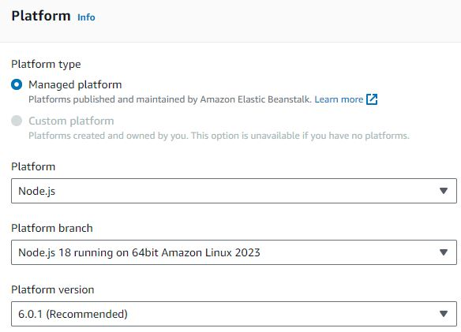

# AWS - Relational - Module 5
1. [Introduction](#intro)
2. [Prerequisites](#prerequisites)
3. [How to deploy manually an app with mock data](#manual-mock)
4. [How to deploy manually an app with MongoDB data](#manual-mongo)
5. [How to deploy automatically an app using docker containers](#automated-docker)
6. [Dockerfile](#docker)

<a name="intro"></a>
## 1. Introduction
The aim of this repository is to deploy to AWS the Node JS Api rest backend application implemented in this [repository](https://github.com/monicacrespo/bootcamp-backend-student/tree/main/4.NodeJs-Api) without the authentication/authorization funcionality. 

To do the deployment it will be used "AWS Elastic Beanstalk" that is an AWS-managed service for web applications. Elastic Beanstalk is a pre-configured EC2 server that can directly take up your application code and environment configurations and use it to automatically provision and deploy the required resources within AWS to run the web application. Unlike EC2 which is Infrastructure as a service, Elastic Beanstalk is a Platform As A Service (PAAS) as it allows users to directly use a pre-configured server for their application. You can deploy applications without ever having to use elastic beanstalk but that would mean having to choose the appropriate service from the vast array of services offered by  AWS, manually provisioning these AWS resources. Elastic Beanstalk abstracts the underlying configuration work for you.

 

There are several ways to deploy the Node JS Api code into AWS EC2. I’ll cover two main methods:
* manual deployment to AWS Elastic Beanstalk (AWS EC2) with mock data and pulling data from MongoDB, and
* automatic deployment to AWS EC2 using Docker containers and CICD.

There are environment variables and the main ones are the following:
 * API_MOCK = TRUE 
   * The api consumes mocked data. More details in `back\src\dals\mock-data.ts` file. 
   * The images of the listings/houses are stored localy under back\public folder. Make sure the listing's url in `back\src\dals\mock-data.ts` has the forward slash, e.g. `listing_url: '/02-detalle-casa.jpg`. 
 * API_MOCK = FALSE 
   * The data is stored in MongoDB database. 

  * S3_SIGNED_URL = TRUE 
    * The images of the listings are stored in S3 and signed. More information in `listingAndReviews.mappers` file.
    * Make sure the listing's url in `back\src\dals\mock-data.ts` or in MongoDB has NOT the forward slash, e.g. `listing_url: '02-detalle-casa.jpg`. 
  
  * S3_SIGNED_URL = FALSE
    * The images are not stored in S3 and they are not signed either. 


The uses cases of this app are the following:
* Rental web api using mock data and local images of the listings. 
  - API_MOCK = true
  - S3_SIGNED_URL = false

* Rental web api using mock data and images of the listings stored in S3 and signed. 
  - API_MOCK = true
  - S3_SIGNED_URL = true

* Rental web api using mongoDB data and local images of the listings.
  - API_MOCK = false
  - MONGODB_URI = "yourmongodbUri"
  - S3_SIGNED_URL = false

* Rental web api using mongoDB data and images of the listings stored in S3 and signed.
  - API_MOCK = false
  - MONGODB_URI = "yourmongodbUri"
  - S3_SIGNED_URL = true


<a name="prerequisites"></a>
## 2. Prerequisites
For all the deployments the first thing that is needed to be is to be created is the production bundle. The steps to create it are described [here](readme-resources/README.md).

The AWS S3 service and how to create and populate a production MongoDB database  can be found [here](readme-resources/README.md).
    
<a name="manual-mock"></a>
## 3. How to deploy manually an app with mock data

These are the steps for deploying manually the rental application to [AWS Elastic Beanstalk](https://docs.aws.amazon.com/elasticbeanstalk/latest/dg/GettingStarted.CreateApp.html):

1. Create an Elastic Beanstalk application named `rental-manual-deployment`.
   

2. Create an Elastic Beanstalk environment: Navigate to the AWS Management Console, select “Elastic Beanstalk”, and click “Create a new environment”. 
   * Choose the “Web server environment” option.
   
   * Choose the "Managed platform" and select "Node.js". You can leave the other settings at their default values.

     
   
   * Upload your Node.js Application. Click “Upload your code”, and 
     * Add the version label, e.g. `v1.0.0`
     * Upload your Node.js application in a ZIP file. Please see how to create it in [How to create the production bundle of the app](readme-resources/README.md). 
     
     
    
   * Configuration Presets: Choose "Single instance (free tier eligible)".

   * Add the following configuration environment variables:
      - API_MOCK = false
      - NODE_ENV = development
      - STATIC_FILES_PATH = "./public"
      - CORS_ORIGIN = false
      - AUTH_SECRET = yourauthsecret
      - MONGODB_URI = yourmongodbUri
      - AWS_ACCESS_KEY_ID = yourawsaccesskeyid
      - AWS_SECRET_ACCESS_KEY = yourawssecretaccesskey
      - AWS_S3_BUCKET = yours3bucket
      - S3_SIGNED_URL = false

     NOTE: Since aws security group was configured only with HTTP inbound rule, we have to set `NODE_ENV` equals `development` to avoid create Cookie with secure flag.

    * Launch Environment: Click “Create environment”. AWS Elastic Beanstalk will handle the details of capacity provisioning, load balancing, and automatic scaling.
    
<a name="manual-mongo"></a>
## 4. How to deploy manually an app with MongoDB data

Once we have the app deployed to AWS manually in API mock mode succesfully, we will deploy the MongoDB in this case in MongoDB Atlas the official cloud site.

First you will need to create a MongoDB Atlas database and get the mongo connection URI. See how to do it [here](#mongodb).

Then, add the following config var on AWS like this:
  - MONGODB_URI = yourmongodbUri
And, modify the following config var like this:
  - API_MOCK = false  

If you want to run locally the app, go to your development app workspace and replace MONGODB_URI env variable in `./back/.env` file with MongoDB Atlas provided value.
```
MONGODB_URI=mongodb+srv://<user>:<password>@<cluster>.mongodb.net/<databaseName>?retryWrites=true&w=majority
```
Note that you need to change the password and add the name of the database.

<a name="automated-docker"></a>
## 5. How to deploy automatically an app using docker containers

Docker is a platform that allows you to package an application with all of its dependencies into a standardized unit for software development. You can use Docker to deploy your Node.Js application to AWS EC2.

Here’s a step-by-step guide of how to deploy automatically an app using docker containers:

1. Create a new Elastic Beanstalk application named `rental-automated-deployment`. 

2. Create an Elastic Beanstalk environment: Navigate to the AWS Management Console, select “Elastic Beanstalk”, and click “Create a new environment”. 
   * Choose the “Web server environment” option.
   
   * Choose the "Managed platform" and select the "Docker platform". You can leave the other settings at their default values.
   
   
   
   * Upload your Node.js Application: 
      * First create a ZIP file with the following content of your Node.js application:     
      
        ```      
        |- back/      
        |- .dockerignore
        |- Dockerfile 
        ```
        In dockerfile make sure to use PORT=80 like it's declared in EC2 > Security Groups > Inbound rules.

      * And then, click “Upload your code”, and upload the ZIP previously created.     
    
        

   * Configuration Presets: Choose "Single instance (free tier eligible)".

   * Add the following configuration environment variables: 
      - NODE_ENV = development
      - AUTH_SECRET = "yourauthsecret"
      - MONGODB_URI = "yourmongodbUri"
      - AWS_ACCESS_KEY_ID="yourawsaccesskeyid"
      - AWS_SECRET_ACCESS_KEY="yourawssecretaccesskey"
      - AWS_S3_BUCKET="yours3bucket"

    * Launch Environment: Click “Create environment”. AWS Elastic Beanstalk will handle the details of capacity provisioning, load balancing, and automatic scaling.      

    * As second approach you could use docker-compose to be executed by Amazon.
      Do not include docker-compose.yml file, it is only mentioned for information purpose `./docker-compose.yml`
      
      ```
      version: "3.8"
      services:
      app:
        container_name: app
        build: .
        ports:
          - "80:80"
        env_file:
          - .env
      ```
3. Use Github Actions as pipeline to deploy the app to AWS and we will need:     
   First, on AWS portal create credentials for GitHub Action to login in AWS with Elastic Beanstalk permissions:
       
    * Create user with Elastic Beanstalk permissions in IAM service.

    * Set Admin Elastic Beanstalk permissions policies by selecting `AdministratorAccess-AWSElasticBeanstalk` policy.

    * Create some credentials to use in our app. 
      * Let's select the new user and click on Security credentials. 
      * Scroll down and click on Create access key. 
      * Select the use case: Application running outside AWS.
      * In the final step, Amazon provides us the Access key ID and Secret access key. We will store this credentials to use it.


   Second, on GitHub repository set the following GitHub secrets:
    * AWS_DEPLOY_ACCESS_KEY_ID: The access key required to connect to Amazon Keyspaces programmatically. 
    * AWS_DEPLOY_SECRET_ACCESS_KEY: The aws_secret_access_key is required to connect to Amazon Keyspaces programmatically. Specifies the secret key associated with the access key. This is essentially the "password" for the access key. 
    * AWS_EB_APP_NAME: same name as we set to Elastic Beanstalk app.
    * AWS_EB_ENV_NAME: environment name that Elastic Beanstalk provides for our app.
    * AWS_REGION: for example eu-west-2.
    * AWS_DEPLOY_S3_BUCKET: auto-generated bucket by Elastic Beanstalk.

	 
   
   And third, create the github action: `./.github/workflows/cd.yml` file
    ```
    name: AWS Continuos Deployment Workflow 

    on:
      push:
        branches:
          - main

    env:
      APP_VERSION_LABEL: ${{secrets.AWS_EB_APP_NAME}}-${GITHUB_SHA}-${GITHUB_RUN_ATTEMPT}

    jobs:
      cd:
        runs-on: ubuntu-latest
        steps:
          - name: Checkout repository
            uses: actions/checkout@v3
          - name: AWS login
            uses: aws-actions/configure-aws-credentials@v1
            with:
              aws-access-key-id: ${{secrets.AWS_DEPLOY_ACCESS_KEY_ID}}
              aws-secret-access-key: ${{secrets.AWS_DEPLOY_SECRET_ACCESS_KEY}}
              aws-region: ${{ secrets.AWS_REGION }}
          - name: Upload files to s3
            run: |
              zip -r ${{env.APP_VERSION_LABEL}}.zip * .dockerignore
              aws s3 cp ${{env.APP_VERSION_LABEL}}.zip s3://${{secrets.AWS_DEPLOY_S3_BUCKET}}/${{env.APP_VERSION_LABEL}}.zip
          - name: Update EB App version
            run: aws elasticbeanstalk create-application-version --application-name ${{ secrets.AWS_EB_APP_NAME }} --version-label ${{ env.APP_VERSION_LABEL }} --source-bundle S3Bucket=${{ secrets.AWS_DEPLOY_S3_BUCKET }},S3Key=${{ env.APP_VERSION_LABEL }}.zip --no-auto-create-application
          - name: Update environment
            run: aws elasticbeanstalk update-environment --environment-name ${{ secrets.AWS_EB_ENV_NAME }} --version-label ${{ env.APP_VERSION_LABEL }}
    ```
    Interesting points about the above workflow:
    1. Credentials to login in AWS with Elastic Beanstalk permissions
    2. AWS login
    3. Upload zipped code with Dockerfile to auto-generate S3 bucket for Elastic Beanstalk
    4. Create a new Elastic Beanstalk app version.

    Here you can see some workflows on the repository:

    


### Update an Application with AWS Elastic Beanstalk
You can follow the instructions in below documentation where it is mentioned step by step on how you can update your application. 

[Update an Application with AWS Elastic Beanstalk](https://docs.aws.amazon.com/elasticbeanstalk/latest/dg/applications-versions.html)

To summarise, below are high-level steps :

1. Make the changes in the app.
2. Create a production bundle following the steps described in [1. How to create the production bundle of the app](readme-resources/README.md).
3. Zip it again.
4. If the code change requires to add/modify environment variables, do so on AWS.
5. Upload it in the Application Version with a different name and click on deploy.
6. Your updated code will be deployed.

### View logs on AWS Elastic Beanstalk

If you get an error when deploy it, you could take more info in logs:


Check file ./var/log/eb-engine.log

<a name="docker"></a>
## 6. Dockerfile

A Dockerfile is a text document that contains all the commands to assemble an image. Your Dockerfile should include instructions to copy your back-end app code and dependencies, to install it and run it.

`./Dockerfile` file

    ```
    FROM node:16-alpine AS base
    RUN mkdir -p /usr/app
    WORKDIR /usr/app

    # Build back app
    FROM base AS back-build
    COPY ./back ./
    RUN npm ci
    RUN npm run build

    # Release
    FROM base AS release
    COPY --from=back-build /usr/app/dist ./
    COPY ./back/public ./public
    COPY ./back/package.json ./
    COPY ./back/package-lock.json ./
    RUN npm ci --only=production

    EXPOSE 80
    ENV PORT=80
    ENV NODE_ENV=production
    ENV STATIC_FILES_PATH=./public
    ENV API_MOCK=false
    ENV CORS_ORIGIN=false
    ENV AUTH_SECRET=MY_AUTH_SECRET
    ENV S3_SIGNED_URL=true

    CMD node/index.js
    ```
    
* We use [multi-stage builds](https://docs.docker.com/build/building/multi-stage/) to decrease this size, with only the necessary info. With multi-stage builds, you use multiple FROM statements in your Dockerfile. Each FROM instruction can use a different base, and each of them begins a new stage of the build. You can selectively copy artifacts from one stage to another, leaving behind everything you don't want in the final image.
* `FROM node:16-alpine AS base`: Use the node image, the alpine version as base image to create our custom one
*  `RUN mkdir -p /usr/app`: Create the path where we are going to copy our app. run commands inside container
* `WORKDIR /usr/app`: all commands after that will be executed in this path.
* `COPY ./back ./`: Copy all files
*  Execute install and build
    ```
    RUN npm ci
    RUN npm run build
    ```
    `npm ci` just installs existing dependencies, in contrast to `npm install`, which attempts to update current dependencies if possible. This ensures that the builds in continuous integration are reliable. It's better to use npm i in development and npm ci for production.

* `EXPOSE 80`: The EXPOSE instruction does not actually publish the port. It functions as a type of documentation between the person who builds the image and the person who runs the container, about which ports are intended to be published.

* `CMD node/index` : RUN vs CMD: CMD doesn't run node server when we build the image, to run it when run the container. More information about CMD and ENTRYPOINT [here](https://docs.docker.com/engine/reference/builder/#understand-how-cmd-and-entrypoint-interact).

### .dockerignore file
`./.dockerignore` file is used to avoid unnecessary files:

```
back/node_modules
back/dist
back/mongo-data
back/.editorconfig
back/.env
back/.env.example
back/.env.test
back/.gitignore
back/create-dev-env.sh
back/docker-compose.yml
```
### How to run the image locally:

First change the port in the Dockerfile:
```
EXPOSE 3001
ENV PORT=3001
```
```
docker build -t rental-store-app:1 .
docker images

docker run --name rental-container --rm -d -p 3001:3000 rental-store-app:1
docker exec -it rental-container sh
```
Open browser in http://localhost:3001

Other docker commands you could use to delete a container or an image.
```
docker images
docker container rm rental-container
docker image prune
docker image rm rental-store-app:1
```
