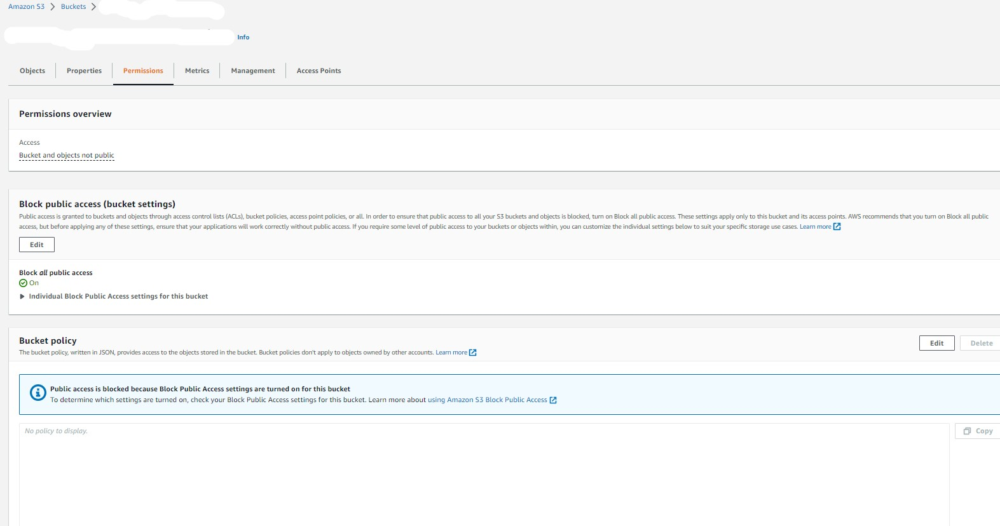
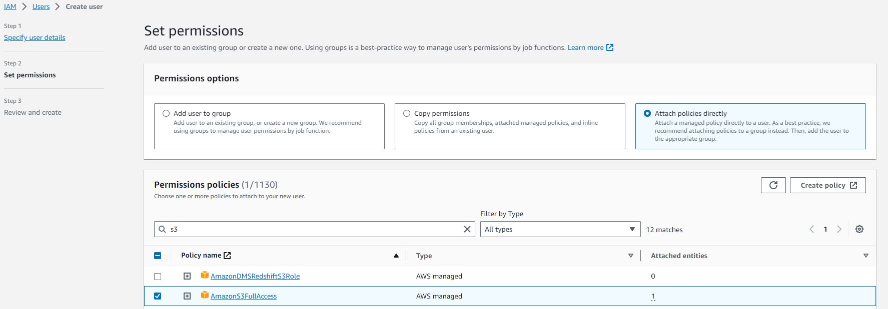
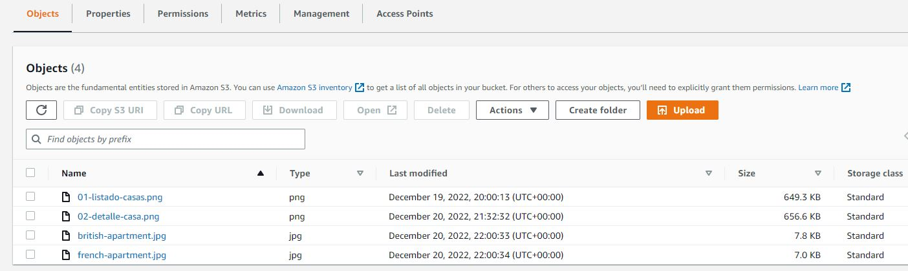
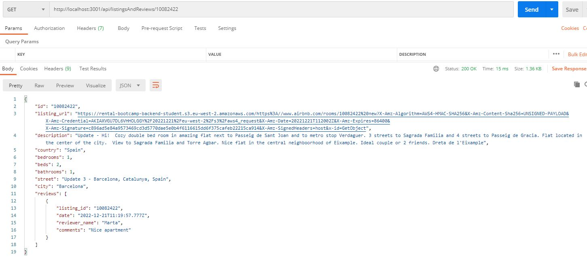
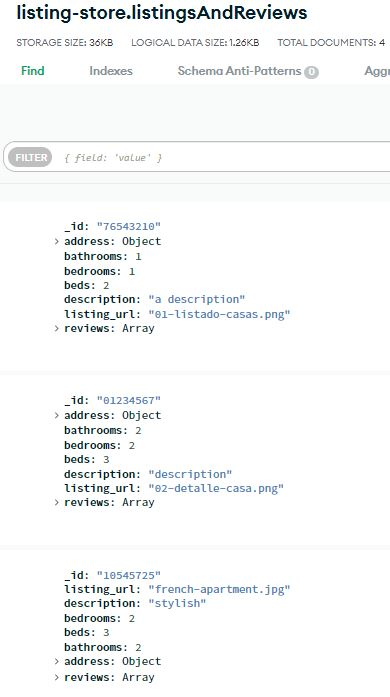
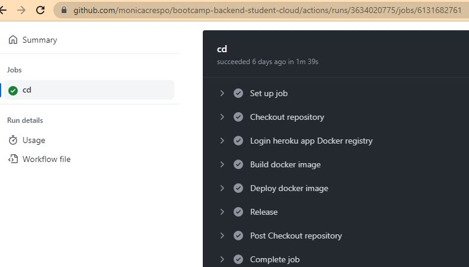

# Prerequisites
1. [How to create the production bundle of the app](#prod-bundle)
2. [AWS Prerequisites](#prerequisites)
3. [How to work with aws-sdk v3 library](#aws-sdk)
4. [How to create and populate a MongoDB database](#mongodb)
5. [How to deploy manually an app with MongoDB data to Heroku](#heroku-manual-mongo)
6. [How to deploy automatically an app with MongoDB data to Heroku](#heroku-automated-mongo)

<a name="prod-bundle"></a>
## 1. How to create the production bundle of the app

1. Go to back folder's terminal and install all the packages
    ```
    cd back
    npm install
    ```
2. Make sure you provide valid env variables with `.env` file like public folder path, port,...

```
NODE_ENV=development
PORT=3001
STATIC_FILES_PATH=../public
CORS_ORIGIN=*
CORS_METHODS=GET,POST,PUT,DELETE
API_MOCK=false
MONGODB_URI=yourmongodbUri
AUTH_SECRET=yourauthsecret
AWS_ACCESS_KEY_ID=yourawsaccesskeyid
AWS_SECRET_ACCESS_KEY=yourawssecretaccesskey
AWS_S3_BUCKET=yours3bucket
S3_SIGNED_URL=false
```

3. Build it: `npm run build`. This will create a `dist` folder with the production version of the rest api rentals app. 

    Now we have something like:
    ```
    ./back

    |-- config/
    |-- dist/
    |   |- common/
    |   |- common-app/
    |   |- core/
    |   |- dals/
    |   |- pods/
    |   |- app.js
    |   |- index.js
    |-- node_modules/
    |-- public/
    |-- src/
    |-- ...
    |-- package-lock.json
    |-- package.json
    ```

    You could run it using node like this:
    ```
    node dist/index.js
    ```
    This is the terminal output:
    ```
    Running API mock
    Server ready at port 3001
    ```
    Open browser in http://localhost:3001/api/listingsAndReviews/10082422

  * Interesting point about the scripts section in `./back/package.json` file:

    ```
    "scripts": {
        ...
        "test:watch": "npm run test -- --watchAll -i",
        "clean": "rimraf dist",
        "build": "npm run type-check && npm run clean && npm run build:prod",
        "build:prod": "cross-env NODE_ENV=production babel src -d dist --extensions \".ts\""
    }
    ```
    * `clean` script: clean dist folder before run a new build
    * `build:prod` script
        * `cross-env NODE_ENV=production` to create inline env variable
        * `babel src -d dist --extensions \".ts\` to compile ts into js files using babel

4. Copy all necessary files:

   * back/dist folder content.
      ```
      |- common/
      |- common-app/
      |- core/
      |- dals/
      |- pods/
      |- app.js
      |- index.js
      ```
    * back/public folder.
    * Create a package.json file. Let's copy back/package.json and delete all the "scripts" commands and add: `"start": "node index.js"`. Also you need to delete the "devDependencies" object.

      The new `./package.json` file will look like this:
    
      ```
      {
        "name": "01-config",
        "version": "1.0.0",
        "description": "",
        "main": "index.js",
        "scripts": {
          "start": "node index.js"
        },
        "keywords": [],
        "author": "",
        "license": "ISC",
        "dependencies": {
          "@aws-sdk/client-s3": "^3.231.0",
          "@aws-sdk/s3-request-presigner": "^3.234.0",
          "cookie-parser": "^1.4.6",
          "cors": "^2.8.5",
          "dotenv": "^16.0.3",
          "express": "^4.18.1",
          "jsonwebtoken": "^8.5.1",
          "mongodb": "^4.10.0"
        }
      }
      ```
    Result:
      
      ```
      |- common/
      |- common-app/
      |- core/
      |- dals/
      |- pods/
      |- public/
      |- app.js
      |- index.js
      |- package.json
      ```
    To upload the code in your deployments, create a zip file with the above files. The `index.js` file is the entry point and the `package.json` file has all the necessary dependencies.

<a name="prerequisites"></a>
## 2. AWS Prerequisites
1. [Setting up Amazon S3](https://docs.aws.amazon.com/AmazonS3/latest/userguide/setting-up-s3.html)
2. Create a [bucket](https://docs.aws.amazon.com/AmazonS3/latest/userguide/creating-bucket.html) in AWS. This bucket will be used to store the pictures of the listings/houses.

   Every object in Amazon S3 is stored in a bucket. Before you can store data in Amazon S3, you must create a bucket.
    
   This bucket name should be unique for all amazon s3 accounts (not only ours) and it should follow some [rules](https://docs.aws.amazon.com/AmazonS3/latest/userguide/bucketnamingrules.html).
    
   Keep the default settings of the bucket and its objects so that they do not have any public access. 
   
        
   To give access to the bucket and objects create a custom user with [IAM service](https://aws.amazon.com/iam/) with credentials. It will be valid for backend apps where we can provide credentials in a secure way. To get your IAM user and its Security credentials (access key ID and secret access key), please follow the instructions [here](https://docs.aws.amazon.com/sdk-for-go/v1/developer-guide/setting-up.html). 
   
   Set AmazonS3FullAccess permissions policies.
   

   Along with the IAM user, we are going to create signed urls with expiration time and send it to web-clients.

3. Upload house's images from `back/public/` folder into the bucket. More information [here](https://docs.aws.amazon.com/AmazonS3/latest/userguide/uploading-an-object-bucket.html).
    

<a name="aws-sdk"></a>
## 3. How to work with aws-sdk v3 library 
The back-end application is consuming the images of the houses stored in an aws s3 bucket because the following libraries are already installed:
* the official `@aws-sdk/client-s3` library. In the v3, it was published different packages to npm, for example client-s3.
* the official `@aws-sdk/s3-request-presigner` to generate a presigned URL programmatically. 
  
 
Those libraries are used as follows:
* `./back/src/core/clients/s3.client.ts` file
  ```
  import { S3Client } from '@aws-sdk/client-s3';
  export const s3Client = new S3Client({ region: 'eu-west-3' });
  ```
  * Barrel file `./back/src/core/clients/index.ts`
  ```
  export * from './s3.client.js';
  ```
* `./back/src/pods/listingAndReviews/listingAndReviews.mappers.ts` mapper to retrieve signed urls from S3:
  ```
  import * as model from 'dals';
  import * as apiModel from './listingAndReviews.api-model';
  import { getSignedUrl } from '@aws-sdk/s3-request-presigner';
  import { GetObjectCommand } from '@aws-sdk/client-s3';
  import { s3Client } from 'core/clients';
  import { envConstants } from 'core/constants';

  const mapPicture = async (picture: string): Promise<string> => {
    const command = new GetObjectCommand({
      Bucket: envConstants.AWS_S3_BUCKET,
      Key: picture,
    });
    const expiresIn = 60 * 60 * 24; // 1 day expiration time.
    // Getting a signed url because the s3 file isn't public
    return await getSignedUrl(s3Client, command, { expiresIn });
  };

  // Review mapping from db to Api
  export const mapListingAndReviewsFromModelToApiAsync = async (
    listingAndReviews: model.ListingAndReviews
    ): Promise<apiModel.ListingAndReviews> => {
      const listing_url = await mapPicture(listingAndReviews.listing_url);
      return {
        id: listingAndReviews._id,
        listing_url,
        description: listingAndReviews.description,
        country: listingAndReviews.address.country,
        bedrooms: listingAndReviews.bedrooms,
        beds: listingAndReviews.beds,
        bathrooms: listingAndReviews.bathrooms,
        street: listingAndReviews.address.street,
        city: listingAndReviews.address.market,
        // Sorting the reviews by latest date
        // TypeScript only allows us to do arithmetic operations with values of type any, number, bigint or enum.
        // The getTime method returns a number
        reviews: listingAndReviews.reviews.sort(function(a, b){ return b.date.getTime() - a.date.getTime() }).slice(0,5)  
      }
  };
  ```
  You can see another example of presigned url [here](https://docs.aws.amazon.com/sdk-for-go/v1/developer-guide/s3-example-presigned-urls.html).

* ./back/src/dals/mock-data.ts
  ```
  {
    _id: '10082422',
    listing_url: 'british-apartment.jpg',
    description: 'description',
    bedrooms: 2,
    beds: 3,
    bathrooms: 2,
    address: {
      street: 'C. Colegios, 8',
      market: 'Alcalá de Henares',
      country: 'Spain',
    },
    reviews: [
      {
        date: new Date('2022-10-08'),
        reviewer_name: 'Monica',
        comments: 'Very Nice',
        listing_id: '10082422',
      },
      ...
    ]
  }
  ```
We need the exact name stored in S3 bucket without slash /.

Here you can see the `listing_url` field is retrieving a signed urls from S3.



<a name="mongodb"></a>
## 4. How to create and populate a MongoDB database

To create a production database in MongoDB Atlas you could follow the steps listed [here](https://github.com/Lemoncode/bootcamp-backend/tree/main/00-stack-documental/05-cloud/02-deploy/03-mongo-deploy).

MongoDB Atlas is a fully-managed cloud database that handles all the complexity of deploying, managing, and healing your deployments on the cloud service provider of your choice (AWS , Azure, and GCP). MongoDB Atlas is the best way to deploy, run, and scale MongoDB in the cloud.

You can fing how to get started using the Atlas UI [here](https://www.mongodb.com/docs/atlas/getting-started) following the next steps:

* Create an Atlas account.

* [Create and deploy a free cluster](https://www.mongodb.com/docs/atlas/tutorial/deploy-free-tier-cluster/). Select the cluster tier, in this case M0 Sandbox which it's a free tier with No backup. Select your provider, in this case AWS and y our region.

* Add your connection IP address to your IP access list.
  
  Configure Network Access. By default, MongoDB Atlas only allows access to configured IPs, let's add a new rule to allow all IPs: 0.0.0.0./0
* Create a database user for your cluster.
 
  Configure Database Access. Add a new user and copy the user and the autogenerated password. We will use them in the MongoDB Connection URI. Also, configure the "readWrite" specific privilege at "databaseName" it is associated with. Leaving collection blank will grant this role for all collections in the database.

* Connect to Your Cluster and get the mongo connection URI. Go to "Deployment > Database" and in your cluster click "Connect". A window will pop-up. Choose "Connect your application to your cluster using MongoDB's native drivers". Copy the url listed. It looks like to something like this, with the right password and name of the database:   
    ```
    mongodb+srv://<user>:<password>@<cluster>.mongodb.net/<databaseName>?retryWrites=true&w=majority
    ```
* Insert and View a Document. To insert listings documents you could use the  console runner under `./back/src/console-runners/create-listings.runner.ts`.

  To run console-runners, on your back folder's terminal run the following command: `npm run start:console-runners`. And select `create-listings`. 
  
  You could check it by using MongoDB Atlas:
  

<a name="heroku-manual-mongo"></a>
## 5. How to deploy manually an app with MongoDB data to Heroku
1. On Heroku website:
    * Create a new application, e.g. `manual-deployment-mock` and follow the steps listed [here](https://github.com/Lemoncode/bootcamp-backend/tree/main/00-stack-documental/05-cloud/02-deploy/02-manual-heroku-deploy).

    * Once the application has been created, add config vars on Heroku. Config vars are exposed to your app's code as environment variables. To do so, go to the "Settings" page, scroll until you see the "Config Vars" section. 
    
        Click on "Reveal Config Vars" and add the following variables:
 	    - API_MOCK = false
    	- STATIC_FILES_PATH = "./public"
    	- CORS_ORIGIN = false
    	- AUTH_SECRET = YOUR_SECRET
    
    * Go to the "Deploy" page and click on the `Heroku Git` icon.

2. In your local machine, in another folder outside back application:
    * Install the Heroku CLI

        To give access to the `Heroku Git` app repository, install globally heroku cli: `npm install -g heroku`

        If you haven't already, log in to your Heroku account with this command: `heroku login`

    * Clone to your local machine the repository generated on Heroku once the `manual-deployment-mock` application has been created: `git clone <yourHerokuGitUrl> .`

        To get `yourHerokuGitUrl` go to Heroku website, choose your app > Settings > App Information.

3. Deploy your changes to Heroku using Git
    1. Unzip `manual-rental-store-api.zip` file and copy all necessary files to the code you just cloned.

        Result:
        ```
        |- common/
        |- common-app/
        |- core/
        |- dals/
        |- pods/
        |- public/
        |- .gitignore
        |- app.js
        |- index.js
        |- package.json
        ```
    2. Deploy it
        ```
        git add .
        git commit -m "deploy app"
        git push
        ```

<a name="heroku-automated-mongo"></a>
## 6. How to deploy automatically an app with MongoDB data to Heroku

Once we have got the app deployed in Heroku with a production database in MongoDB Atlas and it's working, we will use Github Actions as pipeline to deploy the app automatically to Heroku.

First, we will create a different application on Heroku website with the same config vars than the Heroku app with mongodb:
  - API_MOCK = false
  - STATIC_FILES_PATH = "./public"
  - CORS_ORIGIN = false
  - AUTH_SECRET = "yourauthsecret"
  - MONGODB_URI = "yourmongodbUri"

Then we will use Github Actions as pipeline to deploy the app to Heroku. 
   
./.github/workflows/cd.yml

```
name: Continuos Deployment Workflow

on:
push:
    branches:
    - automated-deployment

env:
HEROKU_API_KEY: ${{ secrets.HEROKU_API_KEY }}
IMAGE_NAME: registry.heroku.com/${{ secrets.HEROKU_APP_NAME }}/web

jobs:
cd:
    runs-on: ubuntu-latest
    steps:
    - name: Checkout repository
        uses: actions/checkout@v3
    - name: Login heroku app Docker registry
        run: heroku container:login
    - name: Build docker image
        run: docker build -t ${{ env.IMAGE_NAME }} .
    - name: Deploy docker image
        run: docker push ${{ env.IMAGE_NAME }}
    - name: Release
        run: heroku container:release web -a ${{ secrets.HEROKU_APP_NAME }}
```

GitHub CD Workflow

